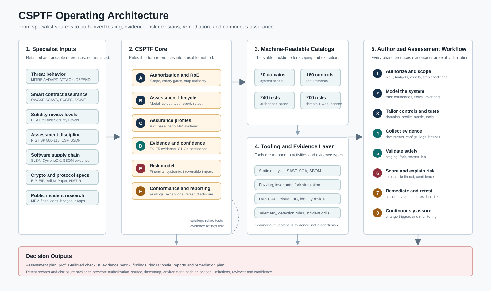

# CSPTF - Framework de Pentesting para Seguridad Cripto

<p align="center"></p>


> **Estado:** `0.1.0-draft` - borrador público fundacional; no constituye una certificación.

CSPTF es un framework abierto y basado en evidencia para la **evaluación de seguridad y pentesting autorizado** de criptomonedas, blockchain, Web3, DeFi, CeFi, wallets, custodia, bridges, contratos inteligentes, nodos, Layer 2, APIs, cloud, gobernanza, monitoreo y resiliencia operacional.

## Qué problema resuelve

Los marcos existentes son sólidos, pero normalmente profundizan en una capa específica: comportamiento adversario, contratos inteligentes, verificación Solidity, aplicaciones web o evaluación general de TI. Un ecosistema de activos digitales combina transacciones irreversibles, incentivos económicos, composabilidad, custodia, consenso distribuido, infraestructura off-chain y obligaciones regulatorias. CSPTF integra esas perspectivas en un ciclo trazable de evaluación.

## Inventario del borrador

| Componente | Cantidad |
|---|---:|
| Dominios de seguridad | 20 |
| Controles normativos | 160 |
| Casos de prueba autorizados | 240 |
| Escenarios de amenaza | 100 |
| Patrones de debilidad | 100 |
| Perfiles de aseguramiento | 4 |
| Niveles de evidencia | 6 |

## Principios

1. Autorización antes que técnica.
2. Testnet, fork y staging antes que producción.
3. No usar activos de clientes por defecto.
4. Revisar invariantes y flujos de valor antes que etiquetas de vulnerabilidad.
5. Incluir impacto económico, sistémico e irreversibilidad.
6. Exigir evidencia, reproducibilidad y retest.
7. Usar automatización como apoyo, no como sustituto del criterio experto.
8. Integrar seguridad, divulgación responsable y cumplimiento legal.

## Inicio rápido

```bash
python tools/validate_catalogs.py
python tools/query_catalog.py --domain BRG --kind tests
python tools/generate_checklist.py --profile AP2 --output build/checklist-ap2.csv
python tools/generate_evidence_matrix.py --profile AP2 --output build/evidence-matrix-ap2.csv
```

## Arquitectura operativa



CSPTF conecta fuentes especializadas, ciclo de evaluacion con autorizacion,
catalogos legibles por maquina, guia de herramientas, niveles de evidencia,
riesgo y salidas de evaluacion. Ver [`docs/architecture.md`](docs/architecture.md)
y [`framework/es/12-herramientas-evidencia.md`](framework/es/12-herramientas-evidencia.md).

Lectura recomendada:

1. [`framework/es/00-carta.md`](framework/es/00-carta.md)
2. [`framework/es/02-reglas-compromiso.md`](framework/es/02-reglas-compromiso.md)
3. [`framework/es/03-ciclo.md`](framework/es/03-ciclo.md)
4. [`framework/es/05-riesgo.md`](framework/es/05-riesgo.md)
5. [`framework/es/12-herramientas-evidencia.md`](framework/es/12-herramientas-evidencia.md)
6. [`domains/README.md`](domains/README.md)

## Documentos de publicación

- [Paper técnico en PDF](paper/CSPTF_Paper_ES.pdf)
- [Paper técnico editable en Word](paper/CSPTF_Paper_ES.docx)
- [Especificación consolidada en PDF](paper/CSPTF_Specification_v0.1_ES.pdf)
- [Especificación consolidada editable en Word](paper/CSPTF_Specification_v0.1_ES.docx)
- [Matriz AP2 de evidencia y herramientas](build/evidence-matrix-ap2.csv)
- [Informe de validación de la release](publication/validation-report-v0.1.0-draft.md)

## Uso responsable

CSPTF solo debe emplearse sobre sistemas propios o con autorización explícita. Las pruebas activas en producción, destructivas, de denegación de servicio, alteración de consenso, manipulación de mercado o movimiento de fondos requieren autorización escrita y específica, monitoreo, límites, presupuesto, reconciliación y autoridad de detención.

## Autor y mantenimiento

**Edwin Javier Peñuela Camacho** (`@sr-maximus`)

## Licencia

Apache License 2.0.
